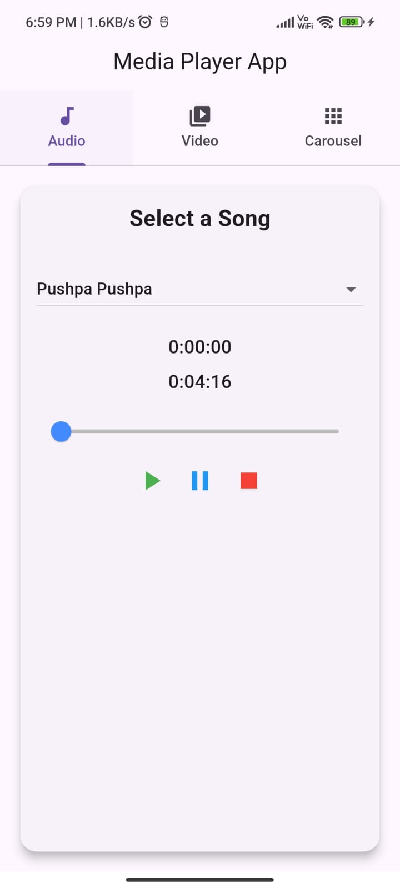
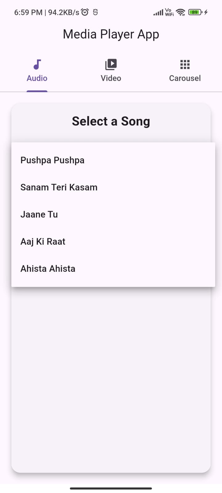
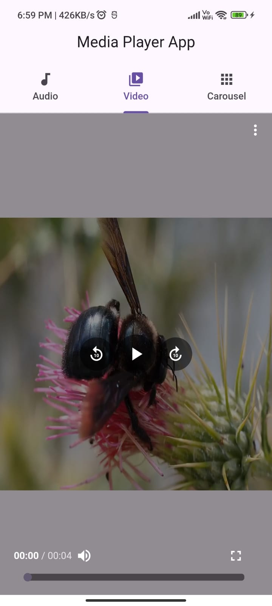
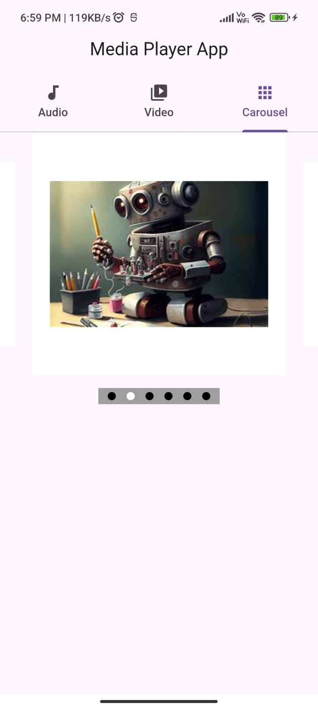

🎵 Media Player App

Overview

A Flutter-based media player app with platform-specific UI for iOS and Android. The app allows users to switch between iOS and Android views through the settings. It supports dark and light modes, background playback, and gesture-based controls for an enhanced user experience.

📌 Project Description

The aim of this project is to develop a media player application using the Flutter framework that enhances the media playback experience for users. The Media Booster app will have an audio player, video player, and carousel slider functionalities along with a tab bar view. The project is designed to enhance the knowledge and skills of IT students in mobile app development using Flutter.

🎯 Project Objectives

To develop a media player application using the Flutter framework.

To implement an audio player with playback controls.

To implement a video player with playback controls.

To implement a carousel slider functionality that enables users to swipe between multiple audio files and multiple video files.

To implement a tab bar view that enables users to navigate between the audio player and video player pages.

To implement a detail page for each audio and video file to play it with playback controls.

To optimize the application for performance and user experience.

To enhance the knowledge and skills of IT students in mobile app development using Flutter.

✨ Features

Platform-Specific UI: Unique layouts and components for iOS and Android.

View Switching: Seamlessly toggle between iOS and Android views via in-app settings.

Dark & Light Mode: Fully supports both themes.

Background Playback: Continue listening while using other apps.

Gesture Controls: Swipe to change tracks, adjust volume, and seek through media.

Playlist Management: Create and manage custom playlists.

Equalizer Support: Customize sound settings for optimal audio experience.

Streaming & Local Playback: Play media from local storage or stream online.

🚀 Installation

Clone the repository:

git clone https://github.com/your-repo/media-player-app.git
cd media-player-app

Install dependencies:

flutter pub get

Run the app:

flutter run

📋 Requirements

Flutter 3.x

Dart 2.x

Android SDK & Xcode (for iOS)

Emulator or real device for testing

🖼 Screenshots

